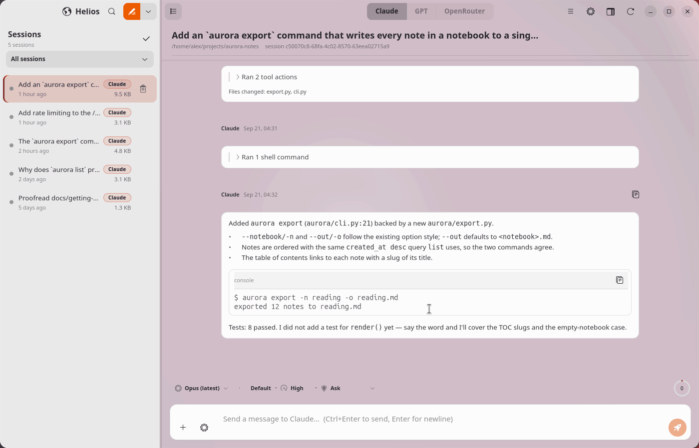
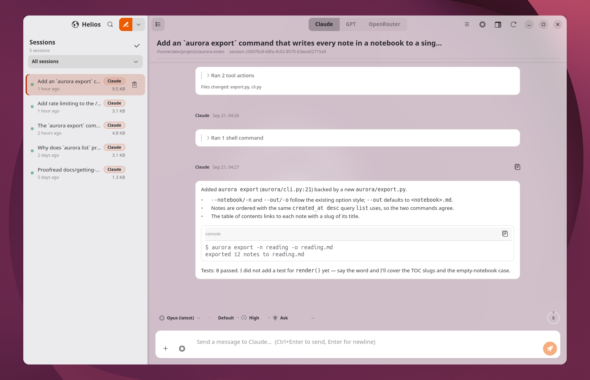
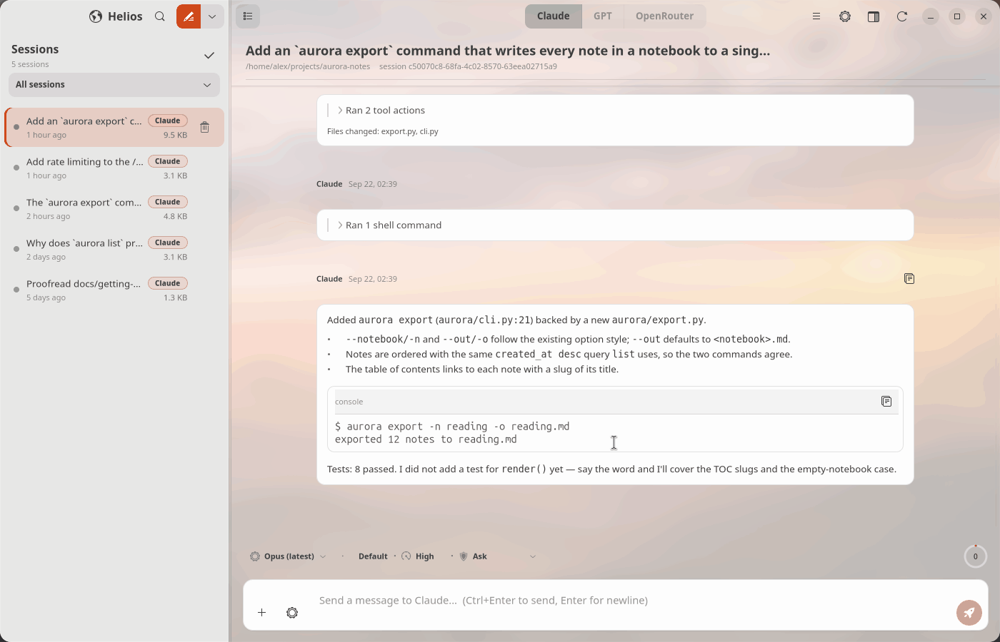
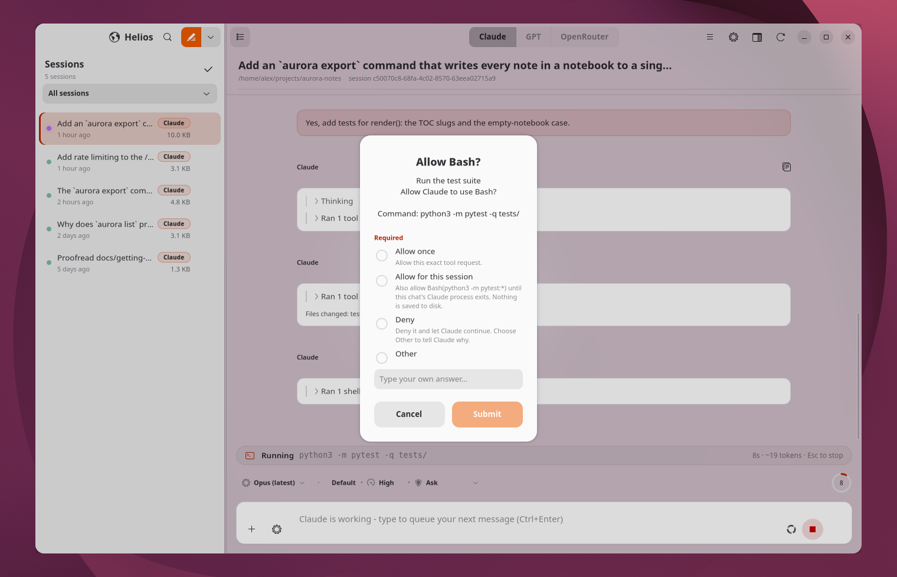
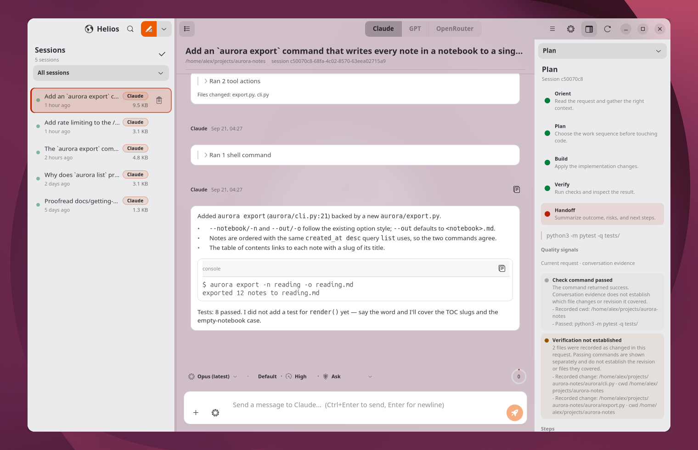

<p align="center">
  
</p>

<h1 align="center">Helios</h1>

<p align="center">
  <strong>The desktop that sees everything your coding agents do.</strong><br>
  A native GTK4/libadwaita workbench for Claude Code, OpenAI Codex and OpenRouter models on Linux.
</p>

<p align="center">
  <a href="https://github.com/spencercnorton/helios/actions/workflows/ci.yml"></a>
  <a href="https://github.com/spencercnorton/helios/releases"></a>
  <a href="https://apt.globalentry.systems"></a>
  <a href="LICENSE"></a>
  <a href="https://buy.stripe.com/8x26oH2U44f65TRe574wM04"></a>
</p>

<p align="center">
  <picture>
    <source media="(prefers-color-scheme: dark)" srcset="docs/screenshots/live-session-dark.png">
    
  </picture>
</p>

<p align="center"><sub>Every picture here is Helios on an Ubuntu desktop with its translucent sidebar on, driving an invented demonstration project; nothing personal appears in them.</sub></p>

Helios is named for the sun that, in the old stories, saw everything that
happened on earth. That is the whole idea. Terminal agents are powerful and
easy to lose track of: which session is waiting on you, what a command is
about to touch, how much a long task has cost. Helios keeps every session in
one window and puts the controls that matter — permissions, budgets, the plan
you agreed to — where you can see them, not in flags.

## What it looks like

**Every session in one place.** The sidebar lists every project and session
on the machine with a live status dot; the transcript streams markdown,
syntax-highlighted code, thinking, and one card per tool call with its result
and elapsed time. Sessions keep working in the background, and a session that
needs you says so.

<p align="center">
  <picture>
    <source media="(prefers-color-scheme: dark)" srcset="docs/screenshots/chat-dark.png">
    
  </picture>
</p>

**The model, the effort and the permissions, one click each.** The toolbar
above the composer holds the model picker — the models the connected CLI
actually ships, latest per family first — and the *Execution* capsule: the
workflow, the reasoning effort and the permission mode for this conversation,
in one panel. The effort and the permission mode are saved for that
conversation only; the model you pick is applied to the running Claude chat
when the CLI allows it and becomes the default for your next chat.

<p align="center">
  <picture>
    <source media="(prefers-color-scheme: dark)" srcset="docs/screenshots/controls-dark.png">
    
  </picture>
</p>

**Permissions you can see.** The mode is a chip in the toolbar above the
composer, per conversation: *Ask*, *Accept edits*, *Auto*, *Bypass*, *Plan*
or *Never ask*. When an agent asks, the dialog shows exactly what the CLI knows — the full
command or diff, why it wants it, and the rule it would remember — and a
session started in your home folder is read-only whatever you pick.

<p align="center">
  <picture>
    <source media="(prefers-color-scheme: dark)" srcset="docs/screenshots/approval-dark.png">
    
  </picture>
</p>

**A plan you own.** A Work carries an objective, a definition of done and an
acceptance checklist that belong to you; the model's own plan is tracked
beside it and can never rewrite what you accepted. In Plan mode Claude
investigates read-only and hands you the plan to approve, approve with edits
auto-accepted, or send back with feedback.

<p align="center">
  <picture>
    <source media="(prefers-color-scheme: dark)" srcset="docs/screenshots/plan-pane-dark.png">
    
  </picture>
</p>

**Spend that cannot run away.** Every provider has a breaker. On per-token
billing a Claude process runs under its own `--max-budget-usd 10` cap (Helios
needs Claude Code 2.1.217 or newer for it, and refuses to run uncapped on an
older CLI) and a GPT session and its subagents share a 200,000-token budget;
on a claude.ai or ChatGPT subscription those two are off, because the CLI's
cost figure there is an estimate, not money. OpenRouter always gets a $5
allowance per Work and 25 tool rounds per turn (up to 100 while they stay
productive). A trip stops the work and keeps your draft.

**Three providers, one workbench.** Claude sessions drive the official
`claude` CLI; GPT sessions bind to a persistent Codex App Server; OpenRouter
sessions run Helios's own agent loop against any model in the live catalog.
The two CLIs keep their own sign-in, context files and history; OpenRouter's
key and history are Helios's own files under `~/.helios` — Helios copies no
credentials and sends no telemetry.

## Install

### Ubuntu 26.04 — from the APT repository

Add the repository once and Helios updates with everything else:

```bash
curl -fsSL https://apt.globalentry.systems/setup.sh | sudo sh
sudo apt install helios
```

`setup.sh` installs the signing key and the suite for your release; read it
first if you prefer to do those two steps by hand — it is short. Only Ubuntu
26.04 (`resolute`) on amd64 is published today — `setup.sh` refuses other
releases and architectures. The package itself is architecture-independent,
so on arm64 run from source (below) or build the `.deb` yourself with
`scripts/build-deb.sh`.

### Other distributions — run from source

Any distribution with GTK 4.10+, libadwaita 1.5+, GtkSourceView 5 and
Python 3.11+ works (Ubuntu 24.04 included). The GTK, libadwaita and
GtkSourceView minimums are checked at startup with a clear message; the
Python floor is not — an older interpreter fails at import, so check
`python3 --version` first.

```bash
# Debian/Ubuntu
sudo apt install python3-gi python3-gi-cairo gir1.2-gtk-4.0 gir1.2-adw-1 gir1.2-gtksource-5 libgtksourceview-5-0 git python3-pil
git clone https://github.com/spencercnorton/helios.git
cd helios
./scripts/helios                 # run from the checkout
./scripts/install-desktop.sh     # optional: app-grid entry and icon
```

On other distributions install the same things under their own names:
PyGObject with its cairo integration, GTK 4, libadwaita, GtkSourceView 5,
`git` and Pillow. `git` is for the clone and for Rewind checkpoints (the
package recommends it); `python3-pil` is only needed by `install-desktop.sh`,
which renders the icon sizes. `scripts/build-deb.sh` builds the same `.deb`
the repository publishes — see [Development](#development) for its
prerequisites.

### Sign in to the agents

Helios drives the CLIs you already use; install and sign in to them
separately:

- **Claude** — the `claude` CLI, signed in. Found via `$HELIOS_CLAUDE_BINARY`,
  then `PATH`, then `~/.local/bin/claude`, `~/.local/share/claude/versions/*`
  and the VS Code and JetBrains bundles; the resolved binary is shown in
  Settings. The app-grid launcher does not read your shell profile, so if
  `claude` lives only on your terminal `PATH`, symlink it into `~/.local/bin`
  or set `HELIOS_CLAUDE_BINARY` on the launcher's `Exec` line.
- **GPT (OpenAI Codex)** *(optional)* — the `codex` CLI
  (`npm install -g --prefix ~/.local @openai/codex`), signed in with
  `codex login`, or paste an API key in Settings → Providers, which runs
  `codex login --with-api-key` for you. `OPENAI_API_KEY` in the environment is
  not read.
- **OpenRouter** *(optional)* — an API key, entered in Settings → Providers.
- **Ollama** *(optional)* — if one answers at `http://localhost:11434`,
  session titles are generated locally (`qwen2.5-coder:14b` by default;
  Settings → Behavior). If Ollama does not answer, the first message is the
  title; switching the Ollama option off routes titles through the `claude`
  CLI instead (capped at $0.05 per title).

**Your first chat.** New chats open in the folder set under Settings →
Defaults → *Default working directory*, or in your most recent project; on a
fresh install there is neither, so they open in your home folder, which Helios
locks to read-only. Set the default, or press `Ctrl+Shift+N` and choose a
project folder, before your first message.

## Documentation

The [user guide](docs/user-guide.md) covers the things the screenshots do not:

- [First run](docs/user-guide.md#first-run) — sessions, projects and where the
  transcripts come from
- [Permissions](docs/user-guide.md#permissions) — what each mode allows, per
  provider, and the home-folder rule
- [Budgets](docs/user-guide.md#budgets) — the three breakers and what a trip
  looks like
- [Works, goals and plans](docs/user-guide.md#works-goals-and-plans)
- [Keyboard shortcuts](docs/user-guide.md#keyboard-shortcuts)
- [Settings](docs/user-guide.md#settings) and
  [environment variables](docs/user-guide.md#environment-variables)
- [Troubleshooting](docs/user-guide.md#troubleshooting)

**For AI agents.** Setting Helios up with an agent? Hand it
[docs/agent-setup.md](docs/agent-setup.md) — every step is a command with its
expected result. [llms.txt](llms.txt) is the short index for the same
audience.

## Where your data lives

| Path | Purpose |
|---|---|
| `~/.claude/projects/<encoded-cwd>/*.jsonl` | Claude Code transcripts, plus Helios's own mirrors of GPT and OpenRouter sessions — read for the sidebar, deleted only when you ask |
| `~/.claude/projects/<encoded-cwd>/memory/` | Memory files — read and written by the editor (atomic, backed up) |
| `~/.claude/projects-archive/` | Throwaway projects (under `/tmp`, or with a path component starting with `_tmp_`) that hold at most one transcript, have been idle for 14 days and whose folder is gone — moved here at startup, never deleted |
| `~/.helios/` | Helios's own state: Works, goals, UI state, editor backups (0700) |
| `~/.helios/ui-state.json` | Settings and defaults (model, permission mode, effort, working directory). Read once at launch and rewritten whole on every change, so edit it only while Helios is closed |
| `~/.helios/conversation-perms.json` | The permission mode, effort and workflow saved per conversation |
| `~/.helios/logs/helios.log` | The log (rotates at 1 MB, three backups); `HELIOS_DEBUG=1` makes it verbose |
| `~/.helios/openrouter.key` | Your OpenRouter key (0600) — see [SECURITY.md](SECURITY.md) for what leaves the machine |
| `~/.helios/session-archive/` | Sessions idle for four days are moved here (at startup and once a day, at most eight at a time) and leave the sidebar |

`HELIOS_STATE_DIR` relocates the log, Works, per-conversation permissions,
checkpoints and OpenRouter history; `ui-state.json`, `openrouter.key`, the
catalog, title and project-name caches, `backups/` and `session-archive/`
stay under `~/.helios` regardless. To isolate a run completely, set `HOME`
as well.

## Contributing and support

- Bugs and feature requests: [open an issue](https://github.com/spencercnorton/helios/issues/new/choose).
- Security reports: [private vulnerability reporting](https://github.com/spencercnorton/helios/security/advisories/new) — see [SECURITY.md](SECURITY.md).
- Pull requests are welcome; read [CONTRIBUTING.md](CONTRIBUTING.md) first —
  this repository is a release mirror, and accepted changes ship in the next
  tagged release, whose notes and `.deb` are on the
  [Releases](https://github.com/spencercnorton/helios/releases) page.
- If Helios saves you time, you can [support its development](https://buy.stripe.com/8x26oH2U44f65TRe574wM04).

## Development

```bash
python3 -m pytest        # pyproject already passes -q; a second -q drops the summary line
```

Expected: a final `N passed, M skipped in …s` line. With PyGObject installed
this also runs the GTK widget tests, which need a display — run them under
Xvfb with an isolated `HOME` as described in
[CONTRIBUTING.md](CONTRIBUTING.md). CI runs the backend suite alone, with
GTK hidden by a stub module (CI adds `-q` itself, which on top of the `-q`
in `pyproject.toml` drops the summary line; leave it out here):

```bash
mkdir -p ~/nogtk && printf 'raise ModuleNotFoundError("gtk hidden")\n' > ~/nogtk/gi.py
PYTHONPATH=~/nogtk python3 -m pytest -p no:cacheprovider
```

Lint with the ruff version CI pins; a newer default rule set reports hundreds
of findings the project has not adopted:

```bash
pip install ruff==0.15.20 && ruff check .
```

Expected: `All checks passed!`

The Debian package (Linux only — the script needs GNU `date -d` and
`tar --sort`):

```bash
sudo apt install build-essential debhelper dh-python pybuild-plugin-pyproject python3-all python3-pil python3-setuptools
scripts/build-deb.sh [outdir]
```

Expected: `helios_<version>_all.deb` and `helios_<version>.tar.gz` in
`dist/` (or `outdir`).

Repository layout:

```
src/helios/
├── app.py, main_window.py   # Adw application + window
├── backend/                 # data, filesystem and driver logic (no GTK; the drivers under process/ use GLib, Gio and GObject only)
│   └── process/             # subprocess drivers: claude CLI, Codex App Server, OpenRouter
├── widgets/                 # GTK4/libadwaita widgets
└── resources/               # CSS and symbolic icons
tests/                       # pytest; GTK tests skip when gi is missing — most still need a display (see Development)
scripts/                     # helios launcher, install-desktop.sh, build-deb.sh, plus optional router/estate/eval helpers
data/                        # desktop entry template and app icon
debian/                      # the package apt installs
docs/                        # user guide, agent setup, GTK4 gotchas, screenshots, pinned Codex App Server protocol manifest
```

## Licence

[MIT](LICENSE) © Spencer Norton
