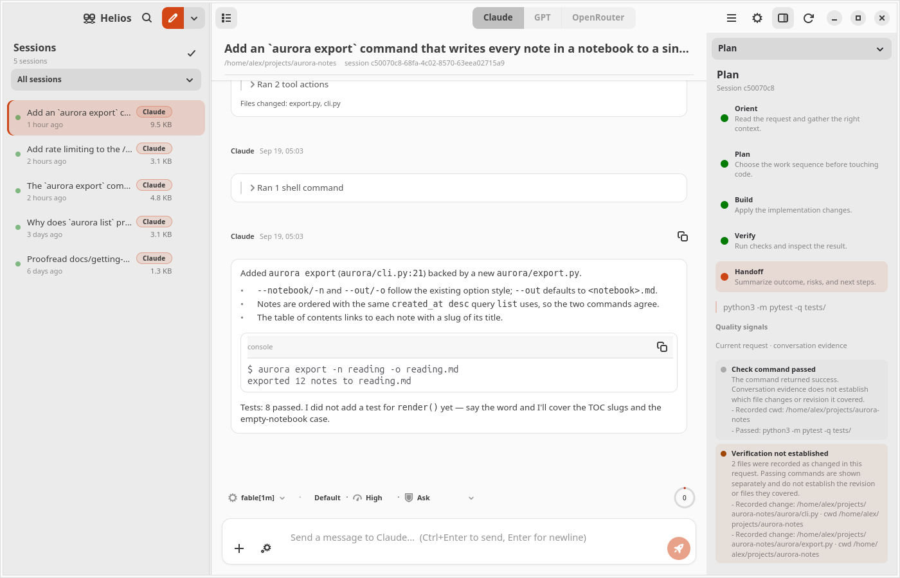

<p align="center">
  
</p>

<h1 align="center">Helios</h1>

<p align="center">
  <strong>The desktop that sees everything your coding agents do.</strong><br>
  A native GTK4/libadwaita workbench for Claude Code, OpenAI Codex and OpenRouter models on Ubuntu.
</p>

<p align="center">
  <a href="https://github.com/spencercnorton/helios/actions/workflows/ci.yml"></a>
  <a href="https://apt.globalentry.systems"></a>
  <a href="LICENSE"></a>
  <a href="https://buy.stripe.com/8x26oH2U44f65TRe574wM04"></a>
</p>

<p align="center">
  <picture>
    <source media="(prefers-color-scheme: dark)" srcset="docs/screenshots/live-session-dark.png">
    
  </picture>
</p>

Helios is named for the sun that, in the old stories, saw everything that
happened on earth. That is the whole idea. Terminal agents are powerful and
easy to lose track of: which session is waiting on you, what a command is
about to touch, how much a long task has cost. Helios keeps every session in
one window and puts the controls that matter — permissions, budgets, the plan
you agreed to — where you can see them, not in flags.

## What it looks like

**Every session in one place.** The sidebar lists every project and session
on the machine with a live status dot; the transcript streams markdown,
syntax-highlighted code, thinking, and one card per tool call with its result
and elapsed time. Sessions keep working in the background, and a session that
needs you says so.

<p align="center">
  <picture>
    <source media="(prefers-color-scheme: dark)" srcset="docs/screenshots/chat-dark.png">
    
  </picture>
</p>

**Permissions you can see.** The mode is a chip beside the composer, per
conversation: *Ask*, *Accept edits*, *Auto*, *Bypass*, *Plan* or *Never ask*.
When an agent asks, the dialog shows exactly what the CLI knows — the full
command or diff, why it wants it, and the rule it would remember — and a
session started in your home folder is read-only whatever you pick.

<p align="center">
  
</p>

**A plan you own.** A Work carries an objective, a definition of done and an
acceptance checklist that belong to you; the model's own plan is tracked
beside it and can never rewrite what you accepted. In Plan mode Claude
investigates read-only and hands you the plan to approve, approve with edits
auto-accepted, or send back with feedback.

<p align="center">
  
</p>

**Spend that cannot run away.** Every provider has a breaker: Claude's own
dollar cap per process, a token budget for a GPT session and its subagents,
and a per-Work dollar allowance plus tool-round ceiling for OpenRouter. A trip
stops the work and keeps your draft.

**Three providers, one workbench.** Claude sessions drive the official
`claude` CLI; GPT sessions bind to a persistent Codex App Server; OpenRouter
sessions run Helios's own agent loop against any model in the live catalog.
Each keeps its native sign-in, context files and history — Helios copies no
credentials and sends no telemetry.

## Install

### Ubuntu 26.04 — from the APT repository

Add the repository once and Helios updates with everything else:

```bash
curl -fsSL https://apt.globalentry.systems/setup.sh | sudo sh
sudo apt install helios
```

`setup.sh` installs the signing key and the suite for your release; read it
first if you prefer to do those two steps by hand — it is short. Only
`amd64`/`all` packages for 26.04 are published today.

### Other distributions — run from source

Any distribution with GTK 4.10+, libadwaita 1.5+, GtkSourceView 5 and
Python 3.11+ works (Ubuntu 24.04 included). The minimums are checked at
startup with a clear message rather than a late crash.

```bash
sudo apt install python3-gi python3-gi-cairo gir1.2-gtk-4.0 gir1.2-adw-1 gir1.2-gtksource-5 libgtksourceview-5-0
git clone https://github.com/spencercnorton/helios.git
cd helios
./scripts/helios                 # run from the checkout
./scripts/install-desktop.sh     # optional: app-grid entry and icon
```

`scripts/build-deb.sh` builds the same `.deb` the repository publishes.

### Sign in to the agents

Helios drives the CLIs you already use; install and sign in to them
separately:

- **Claude** — the `claude` CLI, signed in. Found via `$HELIOS_CLAUDE_BINARY`,
  then `PATH`, then the standalone install locations; the resolved binary is
  shown in Settings.
- **GPT** *(optional)* — the `codex` CLI, signed in with `codex login`.
- **OpenRouter** *(optional)* — an API key, entered in Settings → Providers.

## Documentation

The [user guide](docs/user-guide.md) covers the things the screenshots do not:

- [First run](docs/user-guide.md#first-run) — sessions, projects and where the
  transcripts come from
- [Permissions](docs/user-guide.md#permissions) — what each mode allows, per
  provider, and the home-folder rule
- [Budgets](docs/user-guide.md#budgets) — the three breakers and what a trip
  looks like
- [Works, goals and plans](docs/user-guide.md#works-goals-and-plans)
- [Keyboard shortcuts](docs/user-guide.md#keyboard-shortcuts)
- [Settings](docs/user-guide.md#settings) and
  [environment variables](docs/user-guide.md#environment-variables)
- [Troubleshooting](docs/user-guide.md#troubleshooting)

## Where your data lives

| Path | Purpose |
|---|---|
| `~/.claude/projects/<encoded-cwd>/*.jsonl` | Claude Code transcripts — read for sessions and status, deleted only when you ask |
| `~/.claude/projects/<encoded-cwd>/memory/` | Memory files — read and written by the editor (atomic, backed up) |
| `~/.helios/` | Helios's own state: Works, goals, UI state, editor backups (0700) |
| `~/.helios/openrouter.key` | Your OpenRouter key (0600) — see [SECURITY.md](SECURITY.md) for what leaves the machine |
| `~/.helios/session-archive/` | Transcripts moved out of the sidebar by automatic archival |

## Contributing and support

- Bugs and feature requests: [open an issue](https://github.com/spencercnorton/helios/issues/new/choose).
- Security reports: [private vulnerability reporting](https://github.com/spencercnorton/helios/security/advisories/new) — see [SECURITY.md](SECURITY.md).
- Pull requests are welcome; read [CONTRIBUTING.md](CONTRIBUTING.md) first —
  this repository is a release mirror, and accepted changes ship in the next
  tagged release.
- If Helios saves you time, you can [support its development](https://buy.stripe.com/8x26oH2U44f65TRe574wM04).

## Development

```bash
python3 -m pytest -q     # backend tests, GTK-free — what CI runs
ruff check .             # lint
scripts/build-deb.sh     # the Debian package, from this tree
```

```
src/helios/
├── app.py, main_window.py   # Adw application + window
├── backend/                 # data, filesystem and driver logic (GTK-free)
│   └── process/             # subprocess drivers: claude CLI, Codex App Server, OpenRouter
├── widgets/                 # GTK4/libadwaita widgets
└── resources/style/         # CSS
tests/                       # pytest, GTK-free
debian/                      # the package apt installs
docs/protocol/               # pinned Codex App Server protocol manifest
```

## Licence

[MIT](LICENSE) © Spencer Norton
